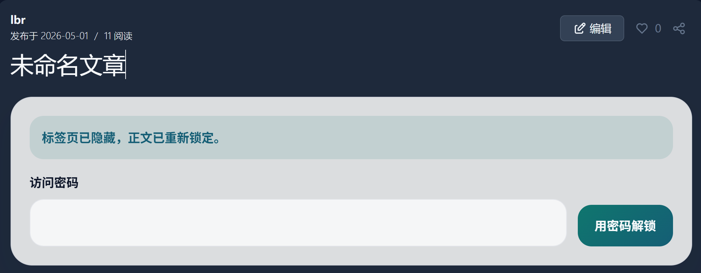
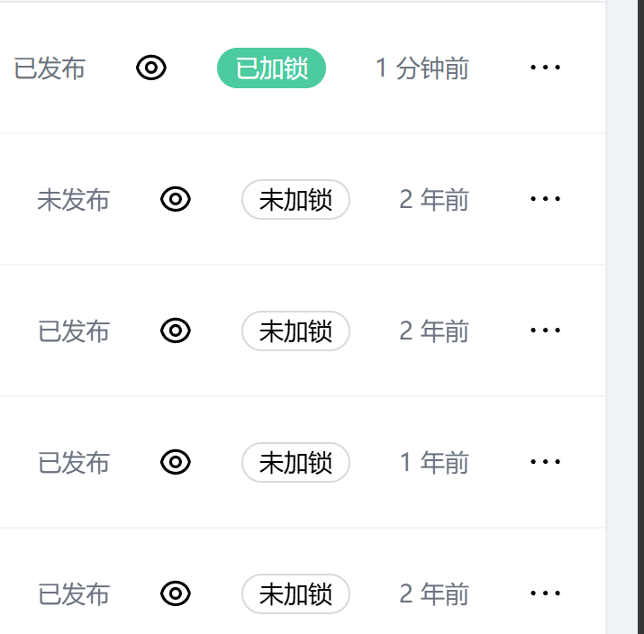

# 文章加密

`文章加密` 是一个 Halo 插件，用来给 Halo 原生文章增加“正文加密、浏览器本地解密、自动重锁”的能力。

文章仍然保持普通 `Post` 工作流：标题、slug、摘要等元数据继续公开，正文则以加密 bundle 的形式保存，并在读者浏览器里本地解密。

## 效果预览

### 编辑页加密面板


### 文章列表状态





## 核心能力

- 直接增强 Halo 原生文章，不维护第二套正文系统
- 文章列表展示 `已加锁 / 未加锁` 状态，可直接点击跳转到编辑器并自动打开设置里的加密模块
- 编辑器设置面板里提供 `文章加密` 模块，勾选后直接走 Halo 原生保存
- 读者在原文章页或独立阅读页输入访问密码后，本地解密正文
- 页面离开、切后台或空闲超时后自动重新锁定
- 后台仅保留平台恢复口令重置页，不暴露正文和内容密钥

## 兼容性

- Halo：`>= 2.24.0`
- 当前版本基于 `EncryptedPrivatePostBundle v3`

## 快速安装

1. 从 GitHub Releases 下载插件 JAR。
2. 在 Halo 后台安装并启用插件。
3. 打开文章列表，点击 `已加锁 / 未加锁` 状态。
4. 插件会跳转到编辑器，并自动打开设置里的“文章加密”模块。
5. 先输入访问密码并勾选启用，再点击 Halo 原生保存。

更完整的上线、升级、回滚和卸载说明见 [docs/OPERATIONS.md](docs/OPERATIONS.md)。

## 了解更多

- 工作方式、数据流和实现边界见 [docs/ARCHITECTURE.md](docs/ARCHITECTURE.md)
- 保存与加密行为标准见 [docs/SAVE_ENCRYPTION_CONTRACT.md](docs/SAVE_ENCRYPTION_CONTRACT.md)
- 测试与发布门槛见 [docs/QUALITY_GATES.md](docs/QUALITY_GATES.md) 和 [docs/SMOKE_TEST.md](docs/SMOKE_TEST.md)

## 文档导航

- [docs/ARCHITECTURE.md](docs/ARCHITECTURE.md)：当前实现的分层、数据流和边界
- [docs/ROADMAP.md](docs/ROADMAP.md)：阶段性进度和后续计划
- [docs/RECOVERY_MODES.md](docs/RECOVERY_MODES.md)：当前恢复模型
- [docs/DOCUMENTATION_STANDARDS.md](docs/DOCUMENTATION_STANDARDS.md)：文档职责边界和更新规则
- [docs/QUALITY_GATES.md](docs/QUALITY_GATES.md)：改动类型与测试 / 构建门槛
- [docs/MAINTENANCE.md](docs/MAINTENANCE.md)：维护说明，记录当前实现约束和主要入口
- [docs/SAVE_ENCRYPTION_CONTRACT.md](docs/SAVE_ENCRYPTION_CONTRACT.md)：保存、加密和密文同步行为契约
- [docs/OPERATIONS.md](docs/OPERATIONS.md)：站点管理员视角的安装、升级、卸载与回滚说明
- [docs/SMOKE_TEST.md](docs/SMOKE_TEST.md)：发布前 smoke test 清单
- [docs/HALO_APP_STORE_SUBMISSION.md](docs/HALO_APP_STORE_SUBMISSION.md)：Halo 商店上架材料与 PR 草案

## 开发要求

- JDK 21
- Node.js 20+（仅在手动执行 `ui/` 下命令时需要）
- npm 10+

Gradle 会自动下载并使用 `Node.js 20.19.0` 构建 `ui/`，然后把产物复制到插件资源目录。

## 本地开发

完整构建：

```bash
./gradlew build
```

快速校验：

```bash
./gradlew quickCheck
```

完整本地验证：

```bash
./gradlew verifyAll
```

启动 Halo 开发容器并首次初始化：

```bash
./gradlew createHaloContainer
```

实例完成初始化后，热重载插件：

```bash
./gradlew reloadPlugin
```

单独验证前端：

```bash
cd ui
npm install
npm run type-check
npm run test:unit
npm run build
```

## 站点上线

如果要部署到真实 Halo 站点，先看：

- [docs/OPERATIONS.md](docs/OPERATIONS.md)
- [docs/QUALITY_GATES.md](docs/QUALITY_GATES.md)
- [docs/SMOKE_TEST.md](docs/SMOKE_TEST.md)
