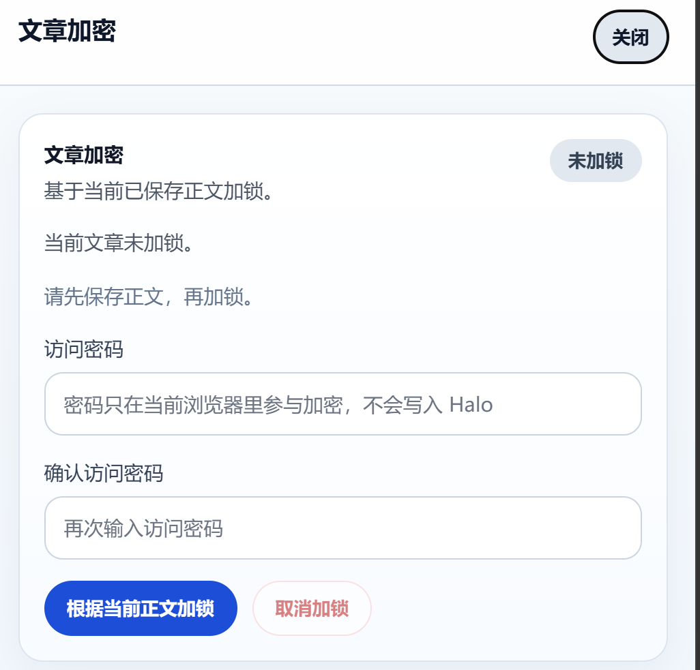

# Halo Private Posts

`Halo Private Posts` 是一个 Halo 插件，用来给 Halo 原生文章增加“正文加密、浏览器本地解密、自动重锁”的能力。

文章仍然保持普通 `Post` 工作流：标题、slug、摘要等元数据继续公开，正文则以加密 bundle 的形式保存，并在读者浏览器里本地解密。

## 效果预览

### 编辑页加密面板



### 文章列表状态


## 核心能力

- 直接增强 Halo 原生文章，不维护第二套正文系统
- 文章列表展示 `已加锁 / 未加锁` 状态，可直接点击进入加密面板
- 编辑页顶部提供 `文章加密` 入口
- 读者在原文章页或独立阅读页输入访问密码后，本地解密正文
- 页面离开、切后台或空闲超时后自动重新锁定
- 后台支持平台恢复口令重置，不暴露正文和内容密钥

## 工作方式

- 加锁基于当前文章已保存的 Markdown 或 HTML 正文
- 前端在浏览器本地完成加密，再把 bundle 写回文章注解
- 服务端同步维护 `PrivatePost` 镜像，处理列表状态、阅读接口和恢复流程
- 原文章页正文区域会被锁定态接管，解锁后原位阅读
- `/private-posts?slug=...` 保留为独立阅读页

## 兼容与协议

- Halo：`>= 2.24.0`
- 当前只支持 `EncryptedPrivatePostBundle v3`

`v3` 使用：

- 随机生成内容密钥 `CEK`
- 用 `CEK` 通过 `AES-256-GCM` 加密正文
- 用 `password_slot` 通过 `scrypt + AES-GCM` 包裹同一个 `CEK`
- 用 `site_recovery_slot` 通过站点恢复公钥包裹同一个 `CEK`
- Halo 服务端不保存访问口令，但会保存站点恢复私钥
- 阅读端公开交互始终只保留访问口令，不暴露恢复入口

## 已实现能力

### 文章流集成

- 基于 `AnnotationSetting` 维护内部注解字段，以及文章列表状态标签/编辑页顶部两处“文章加密”入口
- 文章列表中的“已加锁 / 未加锁”可点击状态字段
- 文章注解 `privateposts.halo.run/bundle` 到 `PrivatePost` 的立即同步与事件补同步
- 再次加锁前的软删除镜像清理，以及 `404/409` 写入重试
- 已删除 / 已回收 / 已取消私密正文文章的镜像自动清理
- 取消私密正文后按 `postName` 补删所有镜像，`404` 不再向用户界面冒泡
- 原文章页正文区域的锁定态接管与原位解锁

### 加密与解密

- `EncryptedPrivatePostBundle v3` 生成、解析、校验和渲染
- Markdown 与 HTML 正文 payload 支持
- 浏览器本地密码解锁
- 后台通过平台恢复能力重写 `password_slot`
- 页面隐藏、离开和空闲超时后的自动重锁

### 平台恢复

- 服务端自动生成并持久化站点恢复 RSA 密钥对
- 前端加锁时只获取恢复公钥，不接触恢复私钥
- 新文章加锁时自动写入 `site_recovery_slot`
- 后台重置口令由服务端解开 `site_recovery_slot` 并重写 `password_slot`
- 重置口令时会同时回写文章真实注解和 `PrivatePost` 镜像，避免状态分叉
- 如果文章注解里的 bundle 只是占位数据、历史脏数据或结构不合法，后台不会再尝试恢复，而会直接要求重新加锁写入有效 bundle

### 前台与接口

- `GET /private-posts?slug=...` 独立阅读页
- `GET /private-posts/data?slug=...` 匿名 bundle 数据接口
- `GET /apis/api.console.halo.run/v1alpha1/private-posts/site-recovery-key`
- `POST /apis/api.console.halo.run/v1alpha1/private-posts/reset-password`
- 匿名阅读入口都返回 `Cache-Control: no-store`，避免旧 bundle 被缓存
- 默认锁定页模板 `private-post.html`

## 快速安装

1. 从 GitHub Releases 下载插件 JAR。
2. 在 Halo 后台安装并启用插件。
3. 打开文章列表，点击 `已加锁 / 未加锁` 状态，或在编辑页顶部点击 `文章加密`。
4. 先保存正文，再输入访问密码并加锁。

更完整的上线、升级、回滚和卸载说明见 [docs/OPERATIONS.md](docs/OPERATIONS.md)。

## 文档导航

- [docs/ARCHITECTURE.md](docs/ARCHITECTURE.md)：当前实现的分层、数据流和边界
- [docs/ROADMAP.md](docs/ROADMAP.md)：阶段性进度和后续计划
- [docs/RECOVERY_MODES.md](docs/RECOVERY_MODES.md)：当前恢复模型
- [docs/MAINTENANCE.md](docs/MAINTENANCE.md)：维护说明，记录当前实现约束和主要入口
- [docs/OPERATIONS.md](docs/OPERATIONS.md)：站点管理员视角的安装、升级、卸载与回滚说明
- [docs/SMOKE_TEST.md](docs/SMOKE_TEST.md)：发布前 smoke test 清单
- [docs/HALO_APP_STORE_SUBMISSION.md](docs/HALO_APP_STORE_SUBMISSION.md)：Halo 商店上架材料与 PR 草案

## 开发要求

- JDK 21
- Node.js 20+（仅在手动执行 `ui/` 下命令时需要）
- npm 10+

Gradle 会自动下载并使用 `Node.js 20.19.0` 构建 `ui/`，然后把产物复制到插件资源目录。

## 本地开发

完整构建：

```bash
./gradlew build
```

启动 Halo 开发容器并首次初始化：

```bash
./gradlew createHaloContainer
```

实例完成初始化后，热重载插件：

```bash
./gradlew reloadPlugin
```

单独验证前端：

```bash
cd ui
npm install
npm run type-check
npm run test:unit
npm run build
```

## 验证建议

- 常规回归：`./gradlew check`
- 打包 smoke check：`./gradlew smokeCheck`
- 开发容器 smoke：`./scripts/dev-container-smoke.sh`
- 一键本地验收（含 smoke、登录态恢复、独立阅读页与卸载演练）：`./scripts/dev-container-acceptance.sh`
- 安装 Playwright 浏览器：`./gradlew installPlaywrightUi`
- 登录态恢复与独立阅读页 e2e：`./gradlew testE2eUi`
- 卸载清理 smoke：`./scripts/dev-container-uninstall-smoke.sh`
- 发版构建 workflow：`.github/workflows/release.yml`
- UI 类型检查：`cd ui && npm run type-check`
- UI 单测：`cd ui && npm run test:unit`
- 插件完整构建：`./gradlew build`

`./scripts/dev-container-acceptance.sh` 默认也会补跑一次卸载演练；如需只跑常规链路，可临时使用 `RUN_UNINSTALL_SMOKE=0 ./scripts/dev-container-acceptance.sh`。
如果要在 GitHub Actions 上手动跑完整链路，可触发 `.github/workflows/full-regression.yml`。
如果要生成正式发布资产，可手动触发 `.github/workflows/release.yml`，或直接推送 `v*` tag；它会执行 `./gradlew smokeCheck`、产出插件 JAR、生成 `SHA256SUMS`，并在 tag 场景下创建 GitHub Release。

## 站点上线

如果要部署到真实 Halo 站点，先看：

- [docs/OPERATIONS.md](docs/OPERATIONS.md)
- [docs/SMOKE_TEST.md](docs/SMOKE_TEST.md)

## 当前不做的事情

- DRM
- 支付或会员系统
- 登录后阅读体系
- 评论后阅读
- 多成员复杂密钥撤销、审计和生命周期管理

## 协议说明

当前代码只支持 `EncryptedPrivatePostBundle v3`。

- `v3`：`password_slot + site_recovery_slot`

如需继续演进协议，应通过显式版本升级完成。
