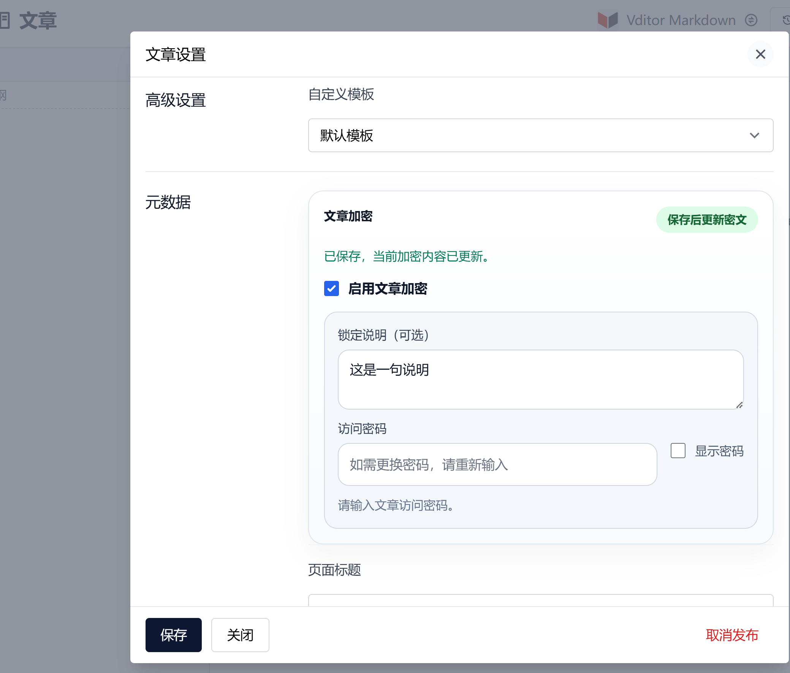
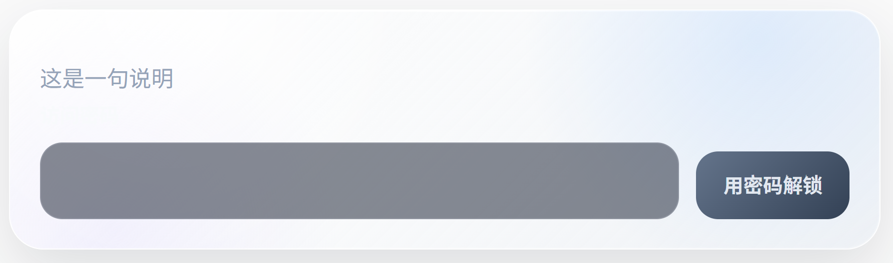
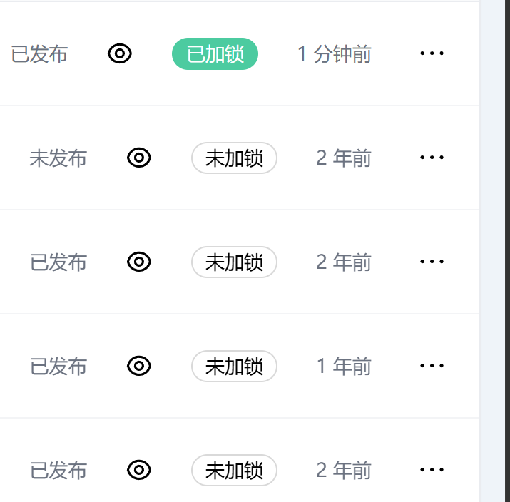

# 文章加密

`文章加密` 是一个 Halo 插件，用来给普通文章加访问密码。

安装后，文章仍然按 Halo 原来的方式创建、编辑和发布。需要隐藏的正文会被加密，读者输入访问密码后才能查看。

## 效果预览

### 编辑页加密面板



### 文章列表状态





## 核心能力

- 给 Halo 原生文章设置访问密码，不需要新建另一套文章。
- 文章列表会显示 `已加锁 / 未加锁` 状态。
- 在文章设置里可以启用、取消或更换访问密码。
- 读者在原文章页输入密码后查看正文。
- 页面刷新、切后台或长时间不操作后会重新锁定。
- 忘记访问密码时，可以在后台用平台恢复能力重置。

## 兼容性

- Halo：`>= 2.24.0`
- 加密保存和前台解锁都需要浏览器支持 Web Crypto API，请用 HTTPS 访问 Halo 前台和后台；本地开发可使用 `http://localhost` 或 `http://127.0.0.1`。
- 建议使用最新版 Chrome、Edge、Firefox 或 Safari；部分旧版浏览器和内嵌 WebView 可能不完整支持相关加密能力。

## 安装

1. 从 GitHub Releases 下载插件 JAR。
2. 在 Halo 后台安装并启用插件。

## 使用

1. 打开文章列表或文章编辑页。
2. 进入文章设置，找到“文章加密”。
3. 勾选“启用文章加密”，输入访问密码。
4. 点击 Halo 原生保存。

取消加密时，回到同一个设置区域，取消勾选后保存即可。

如果保存或解锁时提示“当前环境不支持 Web Crypto API”，通常是因为当前访问地址是普通 HTTP。请切换到 HTTPS 后重试。

## 忘记密码

如果忘记了某篇文章的访问密码，可以进入后台恢复页面重置：

```text
/console/private-posts
```

恢复只会重置访问密码，不会公开文章正文。

## 文档

技术说明、维护约束和测试清单见 [docs/README.md](docs/README.md)。

## 待实现功能
- [x] 锁定状态自定义文字说明
- [ ] 增加即时锁定状态开关，阅读加锁文章时是否离开立即锁定
- [ ] 平台恢复接口增加目标文章编辑权限校验
- [x] 锁定态与正文态和不同主题的视觉融合
- [ ] 更大范围的 Halo 版本和主题兼容性回归
